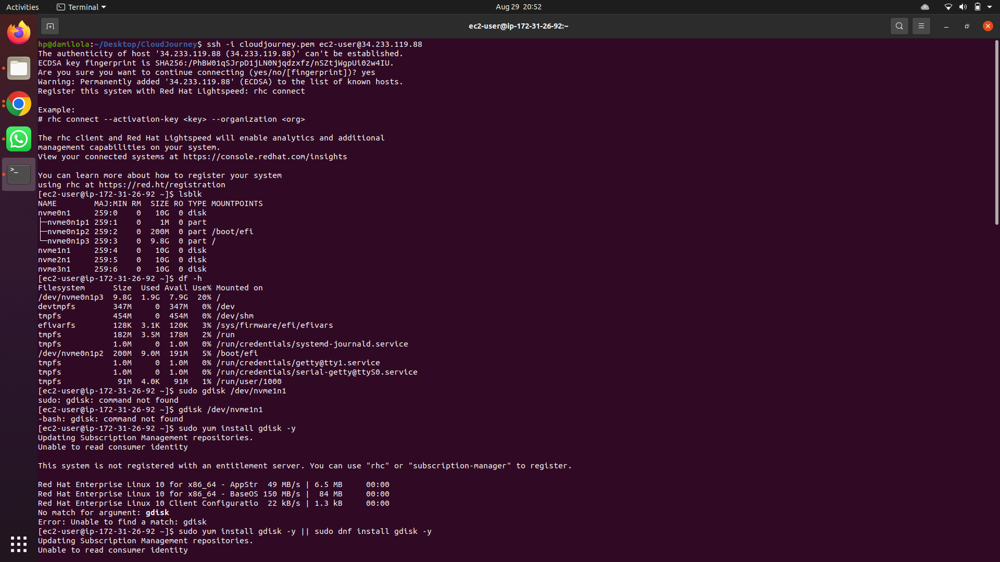
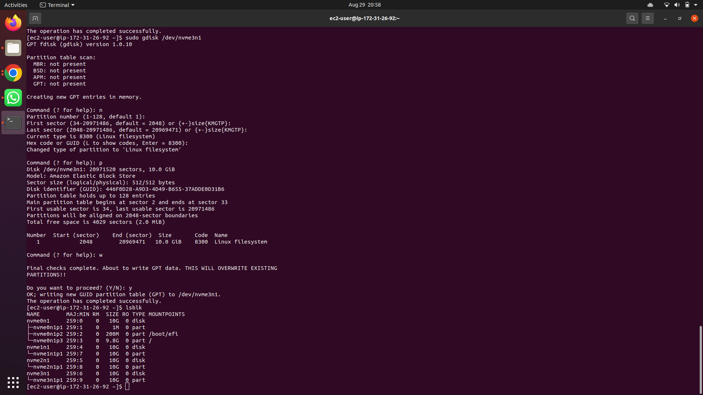
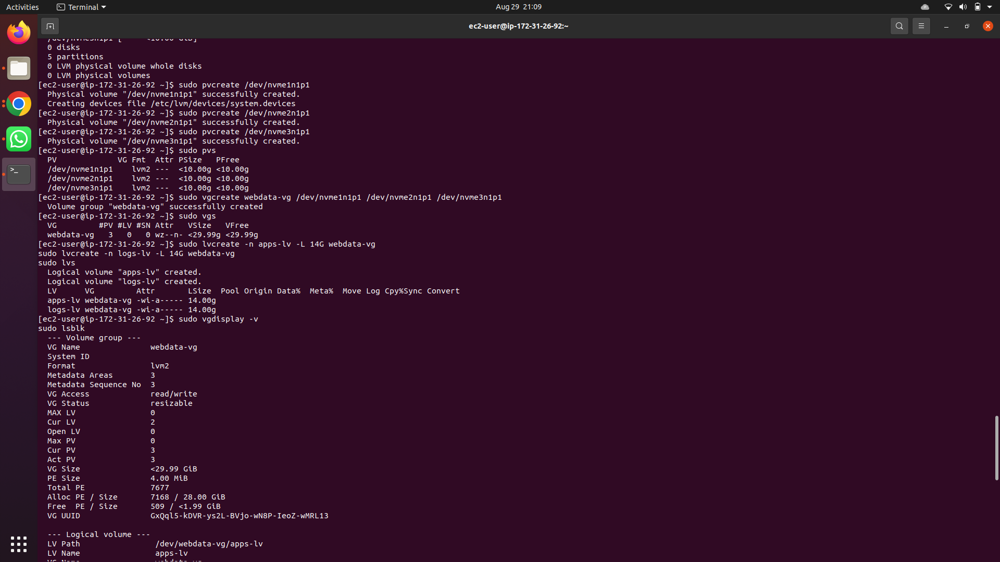
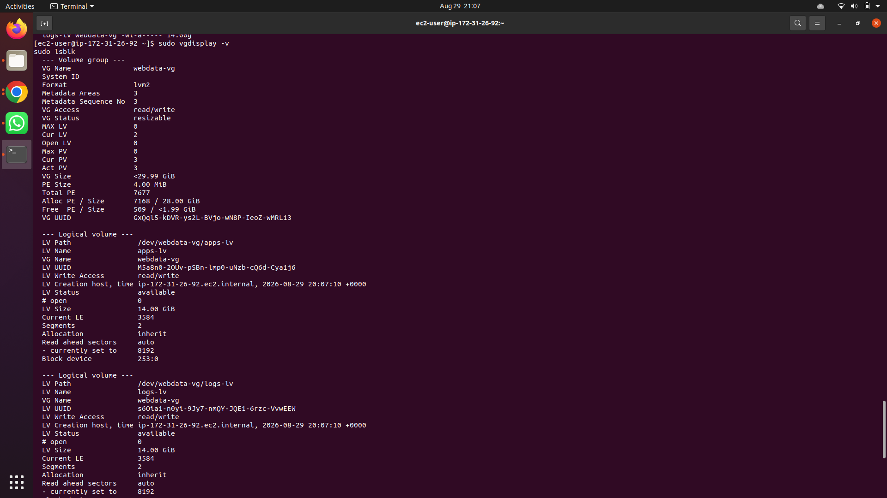
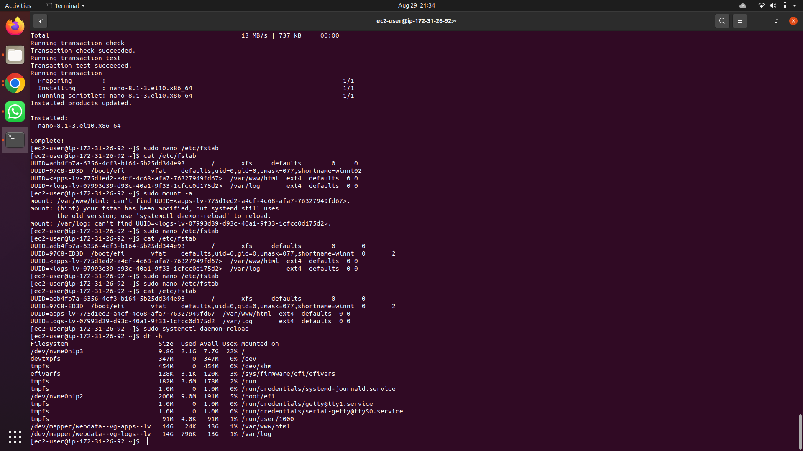
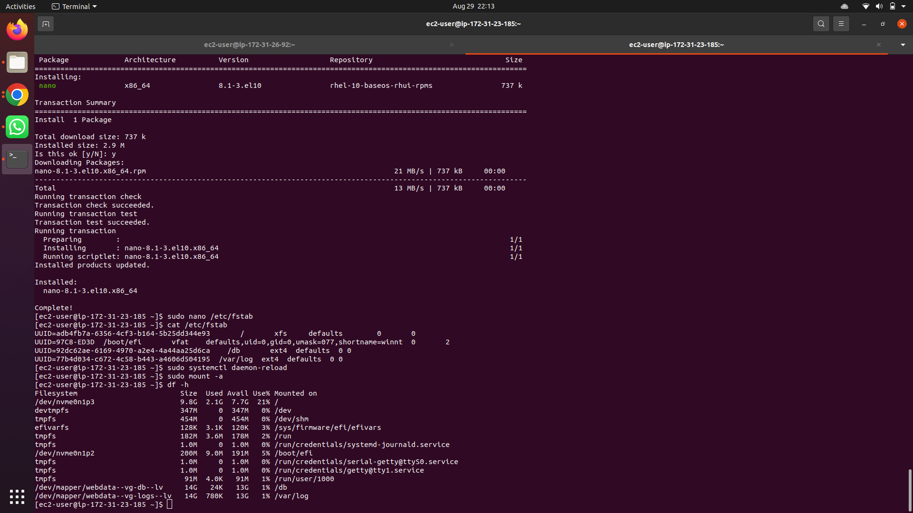
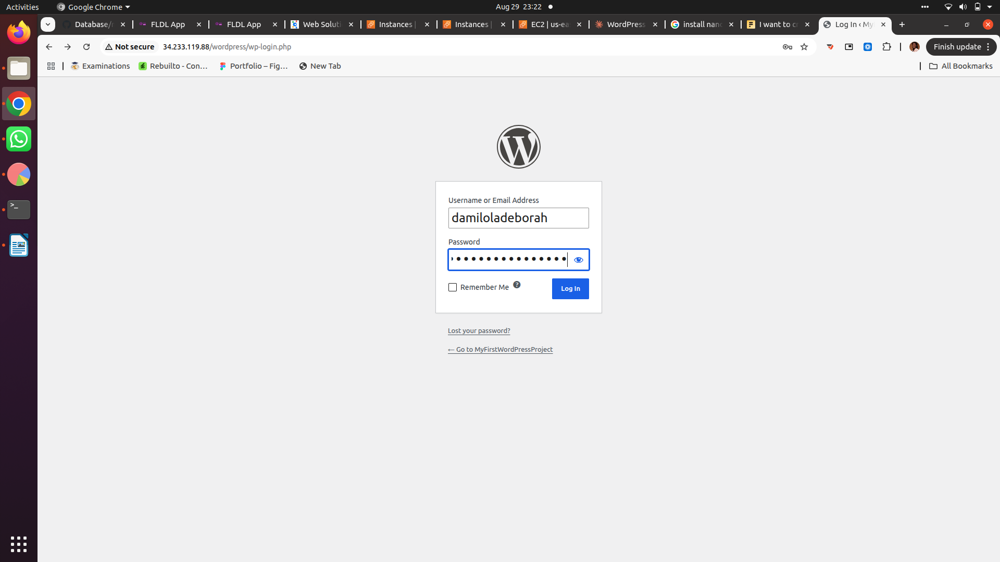
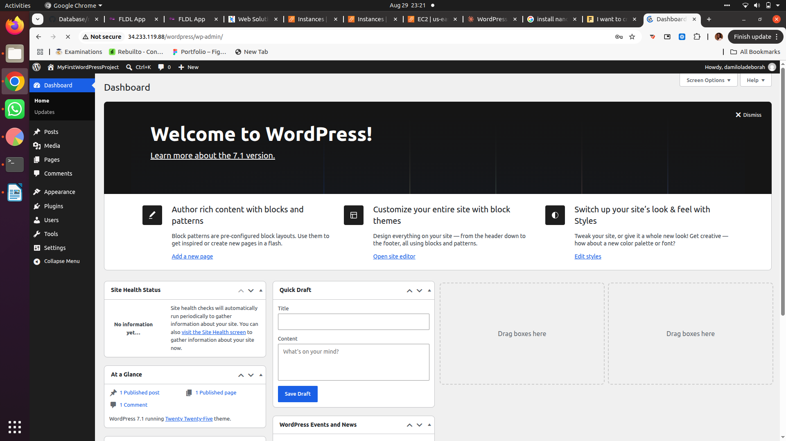

# Web Solution with WordPress — 3-Tier Architecture on AWS

This project implements a basic 3-tier web solution on AWS EC2, using **RedHat Linux (RHEL)** servers, **LVM** for storage management, and **WordPress + MySQL** as the application and database layers.

## Architecture

- **Presentation Layer:** Browser (client)
- **Business Layer:** Web Server (EC2, RHEL) — Apache, PHP, WordPress
- **Data Layer:** DB Server (EC2, RHEL) — MySQL 8.4

---

## Part 1 — Storage Configuration (Web Server)

Three 10 GiB EBS volumes were created in the same Availability Zone as the Web Server and attached to it. On this instance type, the volumes appeared as NVMe devices (`nvme1n1`, `nvme2n1`, `nvme3n1`).

**1. Inspect attached block devices**



**2. Partition each disk with `gdisk`**

Each of the three disks was partitioned using `gdisk` (`n` → `p` → `w`).



**3. Create physical volumes and volume group**

Each partition was marked as a physical volume with `pvcreate`, then combined into a single volume group `webdata-vg` with `vgcreate`. Two logical volumes were then created: `apps-lv` and `logs-lv`.



**4. Verify the full LVM setup**

`vgdisplay -v` confirms the volume group, physical volumes, and logical volumes are all correctly configured.



**5. Format, mount, and persist**

The logical volumes were formatted with `ext4`, mounted to `/var/www/html` (`apps-lv`) and `/var/log` (`logs-lv`), and made persistent via `/etc/fstab` using each volume's UUID.



---

## Part 2 — Storage Configuration (DB Server)

A second RHEL EC2 instance was set up as the DB Server, following the same storage process — three 10 GiB volumes, partitioned and combined into `webdata-vg`, with logical volumes `db-lv` (mounted to `/db`) and `logs-lv` (mounted to `/var/log`).



---

## Part 3 — WordPress Installation (Web Server)

- Apache (`httpd`) and PHP (with `php-fpm`, `php-mysqlnd`, `php-gd`, `php-curl`, `php-opcache`) were installed and started.
- WordPress was downloaded, extracted, and copied to `/var/www/html/wordpress`.
- SELinux policies were configured (`chcon`, `setsebool`) to allow Apache to read/write WordPress files and make outbound network connections to the database.

---

## Part 4 — MySQL Installation (DB Server)

MySQL 8.4 was installed and started on the DB Server.

```bash
sudo dnf install mysql8.4-server -y
sudo systemctl enable --now mysqld
```

---

## Part 5 — Database Configuration

A `wordpress` database and a dedicated user were created, with privileges scoped to connections from the Web Server's private IP only:

```sql
CREATE DATABASE wordpress;
CREATE USER 'usernamehere'@'<Web-Server-Private-IP>' IDENTIFIED BY 'passwordhere';
GRANT ALL ON wordpress.* TO 'myuser'@'<Web-Server-Private-IP>';
FLUSH PRIVILEGES;
```

---

## Part 6 — Connecting WordPress to the Remote Database

Port `3306` was opened on the DB Server's security group, restricted to the Web Server's private IP (`/32`). The MySQL client was installed on the Web Server and used to confirm remote connectivity to the DB Server before updating `wp-config.php`.

**Remote connection test from Web Server to DB Server**


`wp-config.php` was then updated with the database name, user, password, and DB Server private IP, and port `80` was opened on the Web Server's security group.

---

## Part 7 — WordPress Setup

Visiting `http://<Web-Server-Public-IP>/wordpress/` loaded the WordPress installer, confirming the remote database connection was successful. After completing the setup form, WordPress was fully installed.

**Login screen**



**Dashboard**



---

## Result

A working 3-tier WordPress deployment: Apache/PHP web tier on one EC2 instance, MySQL database tier on a second EC2 instance in the same VPC, each with dedicated LVM-managed storage for application data and logs.